```{r setup, include=FALSE}
knitr::opts_chunk$set(collapse = TRUE)
```

```{r, include = FALSE}
htmltools::tagList(rmarkdown::html_dependency_font_awesome())
```

## TL;DR
In this project, we use an Airbnb new users booking dataset to predict the users’ country destination. The dataset come from a previous [Kaggle competition](https://www.kaggle.com/c/airbnb-recruiting-new-user-bookings/data Airbnb). We tried SVM, Random forest, and Xgboost separately and an ensembled model utilizing all three models. XGBoost performed the best. The accuracy rate is 71%. 

## &#9992;Introduction

Airbnb enables people to lease or rent short-term lodging including vacation rentals, apartment rentals, homestays, hostel beds, or hotel rooms. Since 2008, Airbnb has 3,000,000 lodging listings in 65,000 cities and 191 countries, serving more than 60 million users. Analyzing new online user behavior is valuable for generating user specific recommendations, improving the booking success rate and customer retention rate. In this project, we will use the user session data provided by Airbnb to predict user's booking destination. There are 11 unique destination counties in the dataset. We will use user's profile information (such as gender, age, account created date etc) and user's session data (such as action, action type, etc) to classify the destination country.

### Datasets

There are 3 important datasets provided by Airbnb: training, test and session datasets. In the training dataset, there are <span style="color:#fd5c63;">213451 </span>unique user ids; In the test dataset, there are <span style="color:#fd5c63;">62096</span> unique user ids; In thie sessions dataset, there are <span style="color:#fd5c63;">135484</span> unique user ids; 71815 (34.58%) users in the training datasets have data in the session; 61668 (99.31%) users in the test datasets have data in the session. You can see it from the Venn diagram shown below. There are no duplicated IDs in test and training datasets. The labels for the testing data is unknown. The performance of the model on test dataset can only be assessed through kaggle scoring metrics. For our learning purpose, we decide to <span style="color:#fd5c63;">use training dataset only</span> in this project.

```{r echo = FALSE, out.width = "50%", fig.align = "center"}
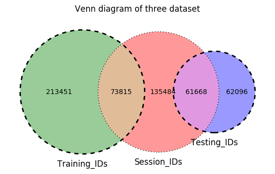
```

### Tools and Packages used

* **<span style="color:#fd5c63;">Data Munging</span>** : pandas, numpy
* **<span style="color:#fd5c63;">Machine Learning</span>** : sklearn
* **<span style="color:#fd5c63;">Visualization</span>** : matplotlib, Seaborn, Plotly


## &#9992;Exploratory Data Analysis
There are 73815 users in both session and training datasets. Now, let us explore the data of these 73815 users data!

### Missing Variables
A lots of values are recorded as --unknown--. Let we replace them with NaN. A lot of users gender, age and first_browser are missing. We will impulate it later in the feature engineering part.
```{r echo = FALSE, out.width = "35%", fig.align = "center"}
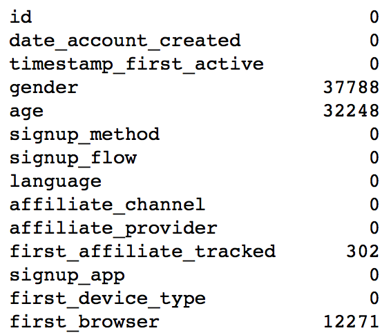
```

### Destination Country Distribution
Most of the users did not book, thus they are marked as NDF(None Destination Found). NDF and US are two dominant categories. The Y distribution is super imbalanced.
```{r echo = FALSE, out.width = "25%", fig.align = "center"}
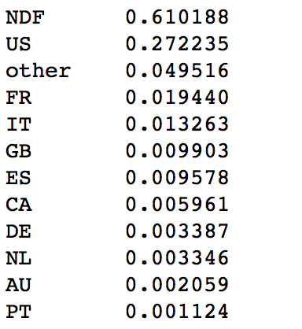
```

### Gender
Well balnaced between male and female with female slightly more.

```{r echo = FALSE, out.width = "50%", fig.align = "center"}
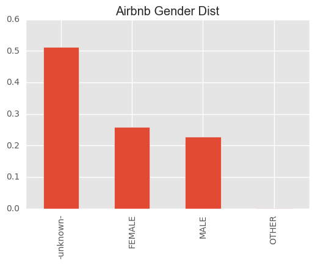
```

We do not find significant difference between two genders for each destination.

```{r echo = FALSE, out.width = "50%", fig.align = "center"}
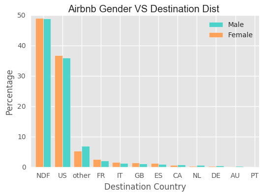
```

### Age
For the age, there are some extreme values. For example, 2 of them are less than 10 and 721 of them are greater than 100 years old. When we draw the age distribution plot, we would omit them. Most of the users are below 40 years old.

```{r echo = FALSE, out.width = "90%", fig.align = "center"}
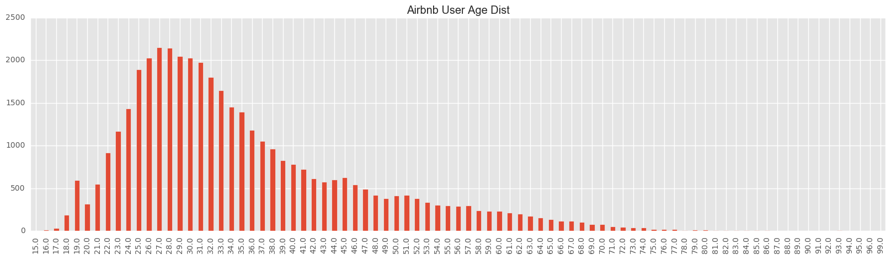
```

For US, young people prefer to book US houses compared with older group. However, the difference is not very obvious.

```{r echo = FALSE, out.width = "50%", fig.align = "center"}
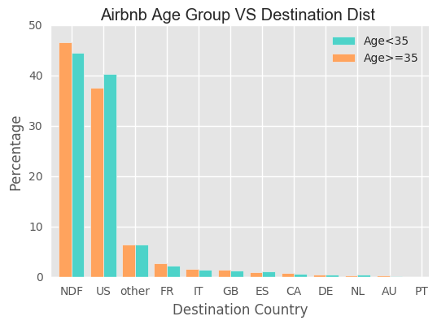
```

### Sign Up Method
* **<span style="color:#fd5c63;">basic</span>** : 55135
* **<span style="color:#fd5c63;">facebook</span>** : 18136
* **<span style="color:#fd5c63;">google</span>** : 544

The users use basic sign up method has a little bit higher probability to book the houses. The below shows a list of affilate providers.
```{r echo = FALSE, out.width = "50%", fig.align = "center"}
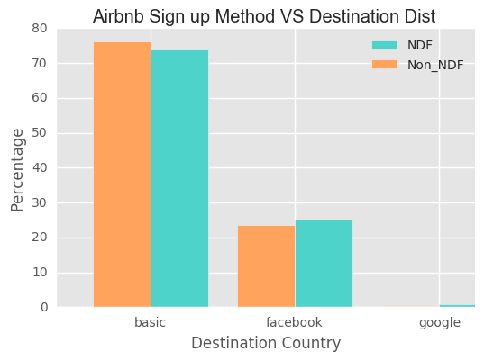
```

affiliate provider
```{r echo = FALSE, out.width = "25%", fig.align = "center"}
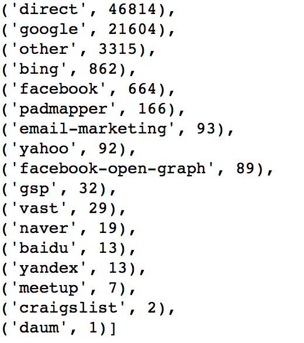
```

### Account Create Month
The number of new accounts keep growing and we do not find obvious seasonal pattern, although there is a littble drop down from Jan to Feb.
```{r echo = FALSE, out.width = "50%", fig.align = "center"}
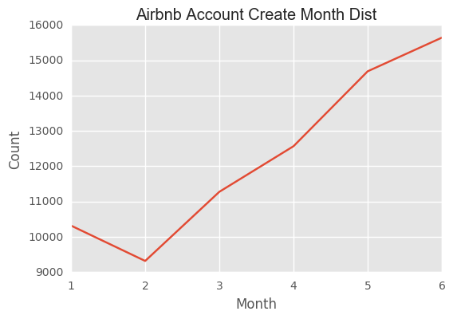
```

### Sessions Related
There are 332 values for action. The most common 10 are shown below.

```{r echo = FALSE, out.width = "35%", fig.align = "center"}
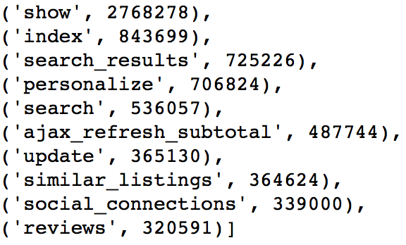
```

The most common action type is

```{r echo = FALSE, out.width = "25%", fig.align = "center"}
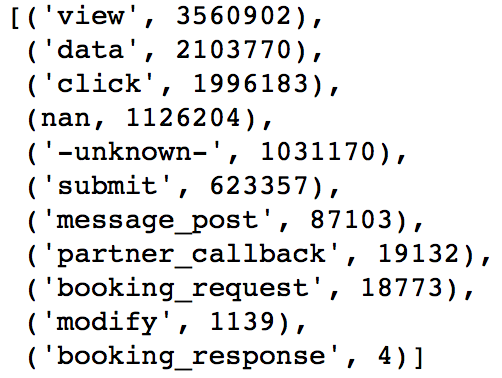
```

There are 129 values for action details. The most common 10 are shown below.

```{r echo = FALSE, out.width = "40%", fig.align = "center"}
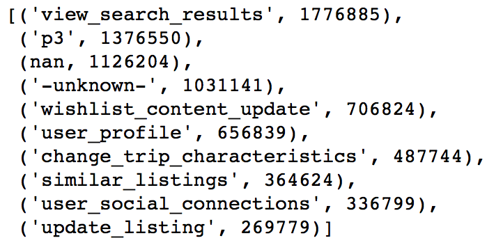
```

We need to clean the nan and -unknown- data later.

## &#9992;Feature Engineering 
In the feature engineering part, not only training dataset but also testing dataset is used. From our previous exploratory data analysis, age of more than 50% users are missing. Therefore, we will use the age and gender distributions provided by Airbnb to imputate those missing values. Since the age distribution includes users in the training and testing datasets, it is necessary for us to use both. And also, the processed testing dataset in this project can be used in the future if we want to explore more after this class.

### Session Dataset
In this session dataset, it has 6 variables, including user id, action (lookup, search results etc), action type (the way they execute that action), action detail(what exactly they lookup, are they viewing results or editing etc), device type (what device they use when they do this action) and secs elapsed (the time they stay in this session). Every time, when users logged in to their account and make actions, their informaiton were recorded. Therefore, each user has more than 1 record. For example, the table shows below. 

```{r echo = FALSE, out.width = "70%", fig.align = "center"}
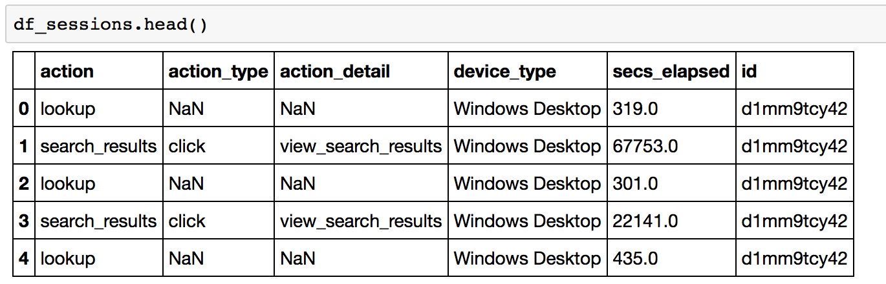
```

In this dataset, there are 365 action values. We group by the action and count each action's frequency. The average number of count is 29214. We decide to change <span style="color:#fd5c63;">action values with less than 100 frequency to 'OTHER'.</span> The resulted dataset has 230 action values. 

In order to merge with training dataset, we need to genearate one record for each user id. Therefore, an important step in this feature engineering is to extract useful statistics from session data and create a new dataset which includes one row for each user.

First, we group by user's id and check the number of actions he/she has done. And then, we are transforming the action, action_type, action_detail, device_type, and section elapsed variables from <span style="color:#fd5c63;"> long to wide format </span>.

Now, we are taking action as a example to show how the transformation process works. First, we sort the action values based on their count descendingly. Action Show has 2768278 rows. It is ranked as the first and its index is 230. You can check the details below. These action values are transformed as the panda dataframe column. Therefore, we transform the dataset from long to wide form. Instead of having one column to show action, we have 231 columns now. The rank index plus one is its column name. Therefore, columns c_1 to c_231 are the one-hot-encoding columns for action. Afte that, columns c_232 to c_234 are the number of unique actions this user did, the mean count of these actions and the standard deviation. 

After transformation, here is a list of columns decriptions and an example of the dataframe. 

* c_1 to c_234: 231 unique action values + # of unique action values for each user + (mean + std) of the count
* c_235 to c_393: 156 unique action detail values + # of unique action detail + mean + std
* c_394 to c_407: 11 unique action types + # of unique action type + mean + std
* c_408 to c_418: (1 + log of sum of elapsed time) for each of the 11 unique action types
* c_419 to c_436: 14 device types + # of unique device type + mean + std
* c_437 to c_456: sections elapsed sum + mean + std + median + total mean + 15 time intervals count

```{r echo = FALSE, out.width = "90%", fig.align = "center"}
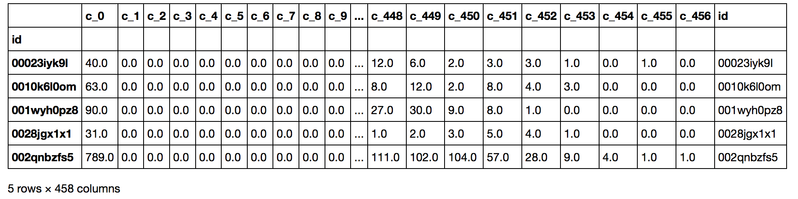
```

### Train + Test Dataset 
After dropping the destination variable in the training dataset, we combine the train and test set. There are 275547 records. Within them, 116866 users' age are missing. 6085 first_affilate_tracked is missing. We also take a look at the NaN or NAN values. In order to process the dataset easily, <span style="color:#fd5c63;"> we replace all missing or unknown values with -1</span>. After this step, we can see that the variables which contains missing values are gender, age, language, first_affiliate_tracked, and first_brower.

```{r echo = FALSE, out.width = "40%", fig.align = "center"}
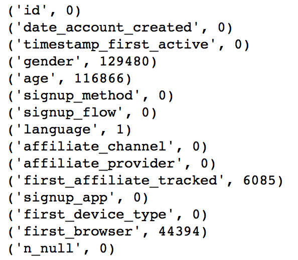
```

For <span style="color:#fd5c63;">gender</span>, there are 47% missing values. It is difficult to impute gender. The only way we can do is to random guess. Therefore, we decide to leave gender like this.

```{r echo = FALSE, out.width = "60%", fig.align = "center"}
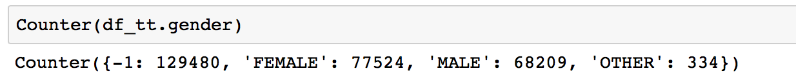
```

For <span style="color:#fd5c63;">age</span>, if the age is between 14 to 99, we think it is reasonable. Otherwise, if the age is between 1900 to 2000, the user may mistakenly input their birth year into the age. Therefore, we substract that year from 2014. If the age is between 0 and 14, we decide to use 14 as their age. If the age is between 2010 to 2016, the user probably input the current year. Then, we decide to use -1 as their age. 

After that, we find may people aged at 105. It is very strange. Therefore, we set those people's age to -1. For people who are aged above 99 and not equal to 105, their age are changed to be 99. There are 118966 people whose age are missing (equal to -1 in our case). The missing values are imputed based on the known age distribution.

For <span style="color:#fd5c63;">language</span>, there is only one person's langauge is unknown. We decide to use english as his/her language since 96% users speak English. After replacing the language to 'en', the frequency list of language is shown below.

```{r echo = FALSE, out.width = "25%", fig.align = "center"}
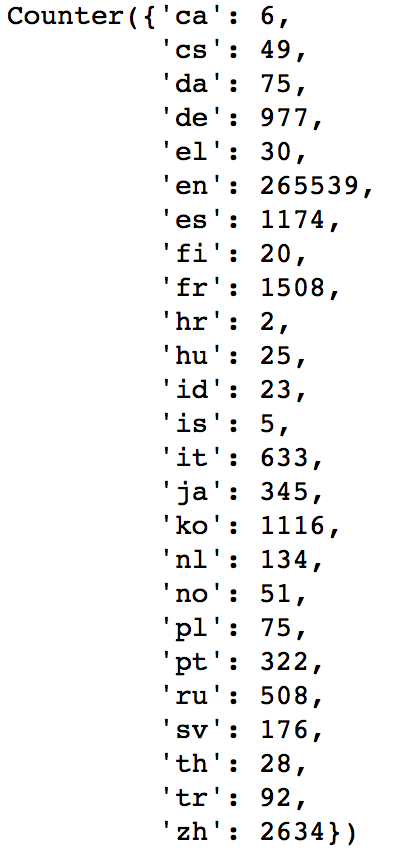
```

For <span style="color:#fd5c63;">first_affiliate_tracked</span> variable, we decide to categorize all the <span style="color:#fd5c63;">unknown to untracked category</span>. The frequency list is shown below.

```{r echo = FALSE, out.width = "35%", fig.align = "center"}
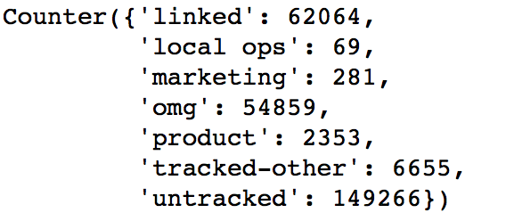
```

For <span style="color:#fd5c63;">first_brower</span> variable, we decide to first combine the values with low frequency (<100> to Other. Then, we decide to <span style="color:#fd5c63;">categorize all the unknown to other</span> as well. The frequency list is shown below.

```{r echo = FALSE, out.width = "35%", fig.align = "center"}
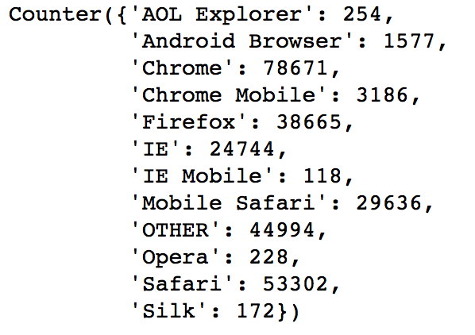
```

After that, we extract more information from user account created date. We find out the year, month, day and calculate in which week they create and on which weekday they create. The weekday information is coded using one-hot-encoding. The reason of doing one-hot-encoding is that many machine learning algorithems (such as linear models, svm, knn etc) cannot handle categorical data. There are two common ways to transform the categorical data. One is to factorize. The other one is to use one-hot-encoding. Factorizing does not help since it does not change the nature of the data. We just use a number to replace the character values. Also, it brings a problem since it imparts an ordinal property to the variable. As this is ordinal characteristic is usually not desired. However, using one-hot-encoding can proper representation of the distinct elements of the variable. It also make easy to fine tune the parameters.

Also the time spans between the account created day and timestamp_first_active is calculated. The sign of this difference is recorded. The season of the account created and timestamp first active are also calculated. The are coded as 0 Winter, 1 Spring, 2 Summer, and 3 Autumn.

The final step is to one-hot-encoding for age intervals and all the categorical variables such as gender, signup method etc.

Finally, the train dataset is joined with session dataset. And the test dataset is joined with session dataset as well. Since we only use the training dataset in this project, I split the training dataset. 20% training dataset is used as test set. The result is used as new training dataset.

#### The datasets used in the machine learning modeling section are  
The train dataset contains 59052 users data. The test dataset contains 14763 users data. 

## &#9992; Machine Learning Models
### SVM
The SVM (Support Vector Machine) is a well-known supervised learning models for both classification and regression. However, it is mostly used in classification problem and is effective in high dimensional spaces.We use the SVC function of sklearn and the default decision function shape is 'one_over_one' for the multiclassification problem. We try both of the linear and RBF kernel. We split the traning data into new training and testing set to tune the parameters. For the linear kernel SVM, we tune the parameter C and the best one is C=1. For the RBF kernel, we tune C and gamma. The best combination is C=1 and gamma=0.1. To speed the algorithm, I use the MinMaxScaler function of sklearn to scale the data and apply PCA to do the demension reduction. In the end, we only keep 40 components. <span style="color:#fd5c63;"> The highest accuracy of the linear kernel is 0.668 when C=10.</span> Compared with C=1, the accuracy just increases 0.01%, but the computing time is 4 times as before. To get a balance between the accuracy and computation time, we choose C=1 for the linear kernel SVM. For the RBF kernel, the highest accuracy is 0.677 when C=1 and gamma=0.1. The running time of this RBF kernel(C=1,gamma=0.1) is three times of the linear kernel(C=1). For the final model, we only fit the linear kernel with C=1.

### Random Forest 
Random forests or random decision forests are an ensemble learning method for classification and regression that operate by constructing a multitude of decision trees at training time and outputting the class that is the mode of the classes (classification) or mean prediction (regression) of the individual trees. Random decision forests gives a robust result and avoid overfitting.
In this model, we tuned two parameters number of trees and max deepth for each tree based on training data. We selected model based on the score for each model. According to 5 folds cross validation, the best model has 400 trees and max depth as 13. The score for this model is 0.68. Then, we apply this model to test data. <span style="color:#fd5c63;"> The accuracy for prediction is 0.6862.</span>

### eXtreme Gradient Boosting (XGBoost)  
XGBoost (eXtreme Gradient Boosting) is an advanced implementation of gradient boosting algorithm. It has great boosting capabilities by ensembling multiple trees together. The advantage of XGBoost includes (1) Regularization: Standard gradient boosting does not have regularization which leads to overfitting. XGBoost is known as 'regularized boosting'; (2)Parallel Processing: The node building and node spliting can be processed parallelly. This lands to an implementation on Hadoop; (3) Handling missing Value; (4) Tree Pruning: Gradient boosting stops pruning a tree when it has a negative loss. However, sometimes, a negative loss may have a positive gain next step. XGBoost optimizes this process.
At the start, the initial values of the parameters are set up in order to find out the best iteration. The initial values includes: max_depth = 5; learning_rate = 0.1; n_estimators = 10000; objective = multi:softprob (The result contains predicted probability of each data point belonging to each class); random_state = 1 (in case we want to repeat the process); eval_metric = mlogloss (multiclass negative log-likelihood). From this model, the best iteration is 111. For tuning boosting parameters, the learning rate = 0.1, n_estimators = 111, objective = multi:softprob, eval_metric = mlogloss are used. Booster parameters tuned in this models are shown below. The parameters are tuned based on the mlogloss metric and using 5 fold cross validation. <span style="color:#fd5c63;"> The best validation accuracy is 0.708. </span>

```{r echo = FALSE, out.width = "90%", fig.align = "center"}
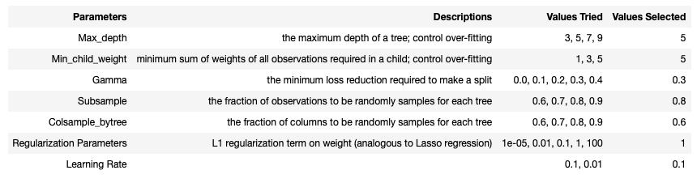
```

### Model Ensemble 
In statistics and machine learning, ensemble methods use multiple learning algorithms to obtain better predictive performance than could be obtained from any of the constituent learning algorithms alone.Unlike a statistical ensemble in statistical mechanics, which is usually infinite, a machine learning ensemble refers only to a concrete finite set of alternative models, but typically allows for much more flexible structure to exist among those alternatives.
We use majority voting to determine final result. We set weight according to accuracy. Accoding to out three accuracy, we set the weight as 33,34,33 for randomforest, svm and xgboost.

### Model Comparision
### ROC
Area under the curve (AUC) value describes the overall performace of a classifier. Based on the area under the curve values, these 3 models plus the ensembled model classify the destination country NDF better than they do on US. XGBoost performs slightly better than the ensembled model. Random Forest performs almost as good as the ensembled method. The reason of this result is because in the ensemble process. We use a heavier weight on xgboost. This dataset is imbalanced. The major country is US and NDF. It is easier to predict the county as US and NDF. It is difficult to classify other countries. Compared to random forest and svm, xgboost does a better job in predicting this minority. Therefore, in the ensemble process, xgboost's vote is more importance. That is the reason why ensemble model is close to xgboost.

```{r echo = FALSE, out.width = "50%", fig.align = "center"}
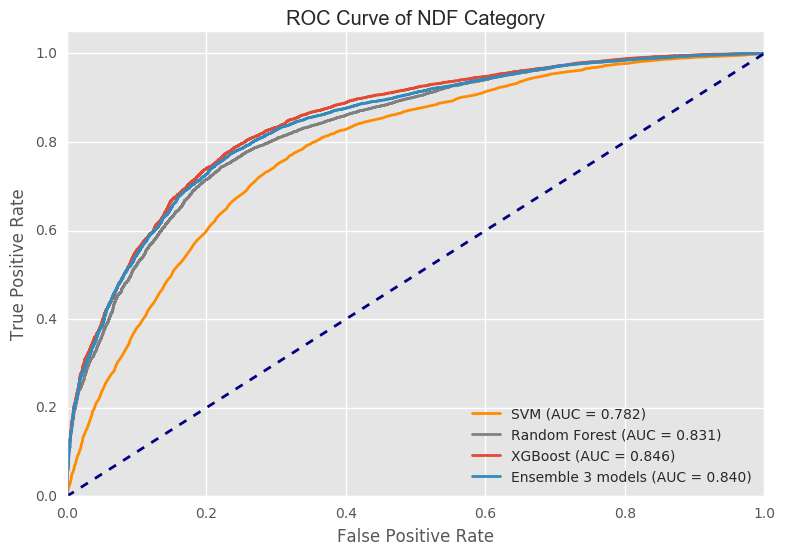
```

```{r echo = FALSE, out.width = "50%", fig.align = "center"}
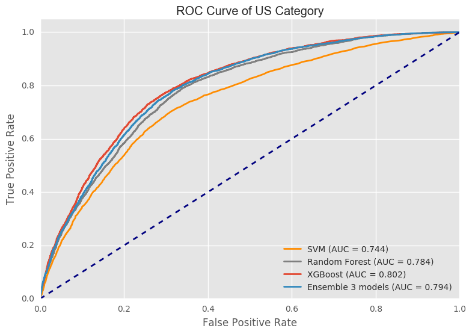
```

#### PR
Presion is the (true positive)/(true positive + false postive). And recall is (true positive)/(true positve + false negative). The precision and recall of NDF category is much better than US category. Overall, the result is similar as ROC curve. XGBoost does better than the other 3 models. 

```{r echo = FALSE, out.width = "50%", fig.align = "center"}
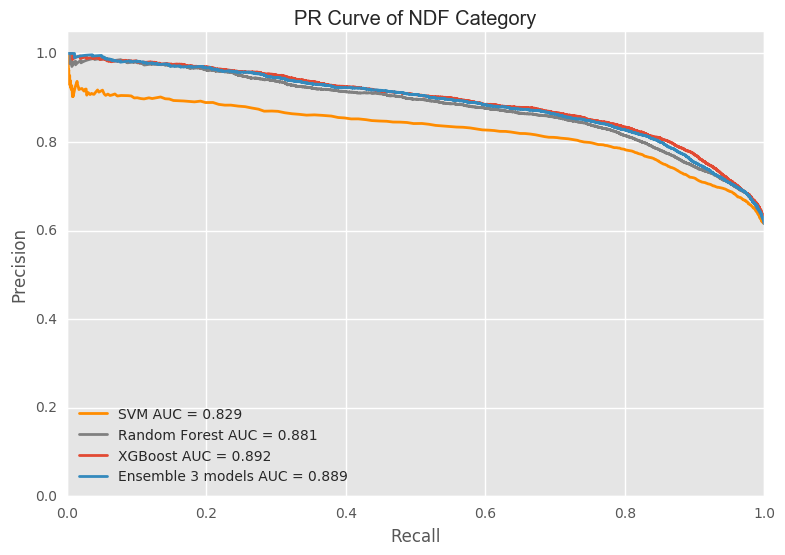
```

```{r echo = FALSE, out.width = "50%", fig.align = "center"}
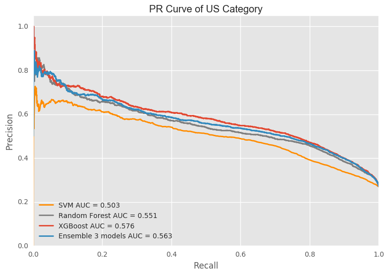
```

#### Confusion Matrix
```{r echo = FALSE, out.width = "50%", fig.align = "center"}
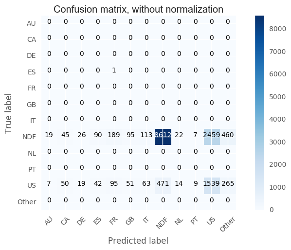
```

## ✈ Conclusion
For the extreme unbalanced data, it is hard for all these models to predict labels for the classes that have low frequencies since the predominat predictions are NDP and USA. Because all these three models have similiar predictions and accuracy, the model ensembling makes no improvement. Precisely, because of the major predictions are NDF and USA, the output of model ensembling will still give these two labels. And what worse, the result of svm and random forest do not predict labels in country except USA and NDF. For the method of majority voting, the result is determinded by the svm and random forest which will even reduce the proportion of correctly predict label of other countries will reduce.
Comparing these models, we can also find that random forest is the fastest one since it will parralling automatically since the trees are independent. Xgboost gives the best accuracy and it successfully predict some labels of labels with lower counts since it will consider the error to adjust the weights of each feature in each step.