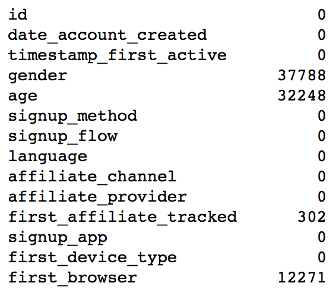
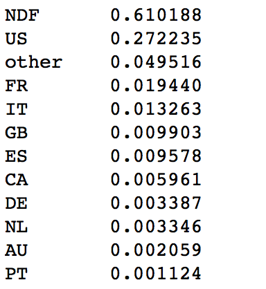
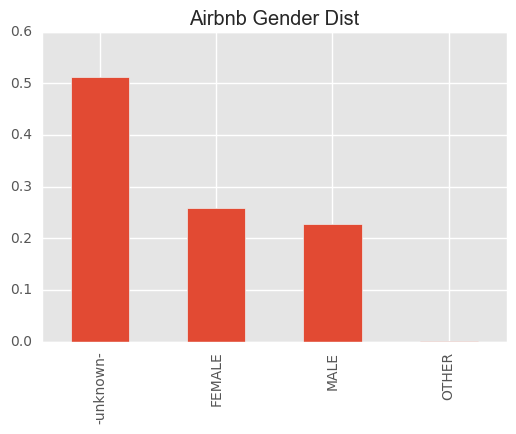
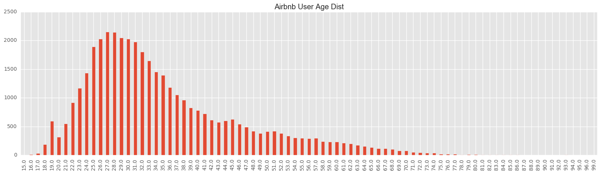
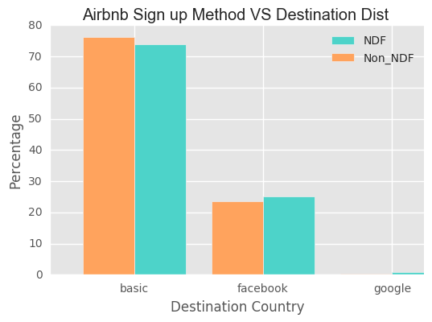
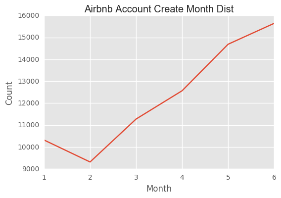
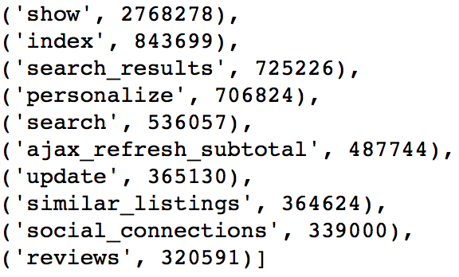
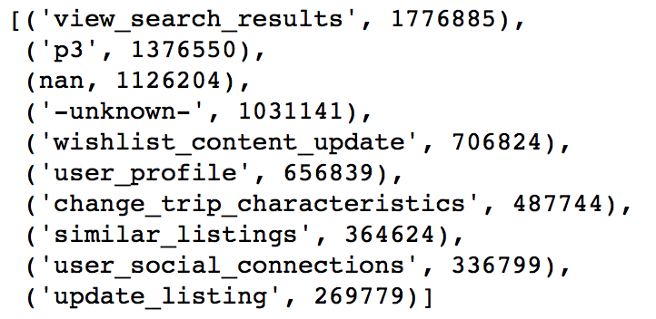
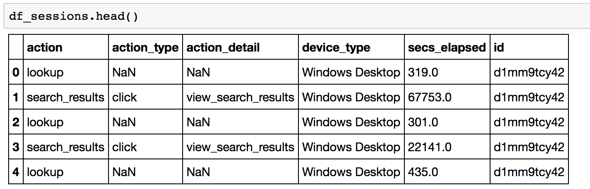
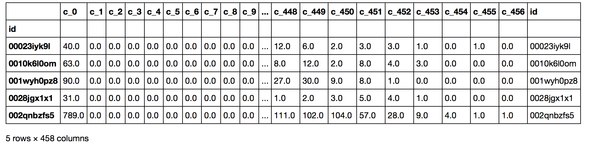

```{r setup, include=FALSE}
knitr::opts_chunk$set(collapse = TRUE)
```

```{r, include = FALSE}
htmltools::tagList(rmarkdown::html_dependency_font_awesome())
```

-   [Introduction](#introduction)
    -   [Datasets](#blogdown)
    -   [Tools and Packages used](#tool)
-   [Exploratory Data Analysis](#eda)
    -   [Missing Variables](#missing)
    -   [Destination Country Distribution](#destination)
    -   [Gender](#gender)
    -   [Age](#age)
    -   [Signup Method](#signup)
    -   [Account Create Month](#month)
    -   [Session Related](#session) 
-   [Feature Engineering](#feature)
-   [Machine Learning Models](#machinelearning)
    -   [SVM](#svm)
    -   [Random Forest](#random)
    -   [Xgboost](#xgboost)
    -   [Ensemble](#ensemble)
-   [Conclusion](#conclusion)
-   [Reference](#reference)    
    

## ✈Introduction

In this project, we use an Airbnb new users booking dataset to predict the users’ country destination. The dataset come from a previous [Kaggle competition](https://www.kaggle.com/c/airbnb-recruiting-new-user-bookings/data Airbnb). Airbnb enables people to lease or rent short-term lodging including vacation rentals, apartment rentals, homestays, hostel beds, or hotel rooms. Since 2008, Airbnb has 3,000,000 lodging listings in 65,000 cities and 191 countries, serving more than 60 million users. Analyzing new online user behavior is valuable for generating user specific recommendations, improving the booking success rate and customer retention rate. In this project, we will use the user session data provided by Airbnb to predict user's booking destination. There are 11 unique destination counties in the dataset. We will use user's profile information (such as gender, age, account created date etc) and user's session data (such as action, action type, etc) to classify the destination country.

### Datasets

There are 3 important datasets provided by Airbnb: training, test and session datasets. In the training dataset, there are <span style="color:#fd5c63;">213451 </span>unique user ids; In the test dataset, there are <span style="color:#fd5c63;">62096</span> unique user ids; In thie sessions dataset, there are <span style="color:#fd5c63;">135484</span> unique user ids; 71815 (34.58%) users in the training datasets have data in the session; 61668 (99.31%) users in the test datasets have data in the session. You can see it from the Venn diagram shown below. There are no duplicated IDs in test and training datasets. The labels for the testing data is unknown. The performance of the model on test dataset can only be assessed through kaggle scoring metrics. For our learning purpose, we decide to <span style="color:#fd5c63;">use training dataset only</span> in this project.

```{r echo = FALSE, out.width = "60%", fig.align = "center"}
knitr::include_graphics("airbnb/0.png")
```

### Tools and Packages used

* **<span style="color:#fd5c63;">Data Munging</span>** : pandas, numpy
* **<span style="color:#fd5c63;">Machine Learning</span>** : sklearn
* **<span style="color:#fd5c63;">Visualization</span>** : matplotlib, Seaborn, Plotly


## &#9992;Exploratory Data Analysis
There are 73815 users in both session and training datasets. Now, let us explore the data of these 73815 users data!

### Missing Variables
A lots of values are recorded as --unknown--. Let we replace them with NaN. A lot of users gender, age and first_browser are missing. We will impulate it later in the feature engineering part.
```{r echo = FALSE, out.width = "40%", fig.align = "center"}

```

### Destination Country Distribution
Most of the users did not book, thus they are marked as NDF(None Destination Found). NDF and US are two dominant categories. The Y distribution is super imbalanced.
```{r echo = FALSE, out.width = "25%", fig.align = "center"}

```

### Gender
Well balnaced between male and female with female slightly more.

```{r echo = FALSE, out.width = "60%", fig.align = "center"}

```

We do not find significant difference between two genders for each destination.

```{r echo = FALSE, out.width = "60%", fig.align = "center"}
knitr::include_graphics("airbnb/4.png")
```

### Age
For the age, there are some extreme values. For example, 2 of them are less than 10 and 721 of them are greater than 100 years old. When we draw the age distribution plot, we would omit them. Most of the users are below 40 years old.

```{r echo = FALSE, out.width = "90%", fig.align = "center"}

```

For US, young people prefer to book US houses compared with older group. However, the difference is not very obvious.

```{r echo = FALSE, out.width = "60%", fig.align = "center"}
knitr::include_graphics("airbnb/6.png")
```

### Sign Up Method
* **<span style="color:#fd5c63;">basic</span>** : 55135
* **<span style="color:#fd5c63;">facebook</span>** : 18136
* **<span style="color:#fd5c63;">google</span>** : 544

The users use basic sign up method has a little bit higher probability to book the houses. The below shows a list of affilate providers.
```{r echo = FALSE, out.width = "60%", fig.align = "center"}

```

affiliate provider
```{r echo = FALSE, out.width = "35%", fig.align = "center"}
knitr::include_graphics("airbnb/8.png")
```

### Account Create Month
The number of new accounts keep growing and we do not find obvious seasonal pattern, although there is a littble drop down from Jan to Feb.
```{r echo = FALSE, out.width = "60%", fig.align = "center"}

```

## Sessions Related
There are 332 values for action. The most common 10 are shown below.

```{r echo = FALSE, out.width = "40%", fig.align = "center"}

```

The most common action type is

```{r echo = FALSE, out.width = "35%", fig.align = "center"}
knitr::include_graphics("airbnb/11.png")
```

There are 129 values for action details. The most common 10 are shown below.

```{r echo = FALSE, out.width = "50%", fig.align = "center"}

```

We need to clean the nan and -unknown- data later.

## Feature Engineering 
In the feature engineering part, not only training dataset but also testing dataset is used. From our previous exploratory data analysis, age of more than 50% users are missing. Therefore, we will use the age and gender distributions provided by Airbnb to imputate those missing values. Since the age distribution includes users in the training and testing datasets, it is necessary for us to use both. And also, the processed testing dataset in this project can be used in the future if we want to explore more after this class.

### Session Dataset
In this session dataset, it has 6 variables, including user id, action (lookup, search results etc), action type (the way they execute that action), action detail(what exactly they lookup, are they viewing results or editing etc), device type (what device they use when they do this action) and secs elapsed (the time they stay in this session). Every time, when users logged in to their account and make actions, their informaiton were recorded. Therefore, each user has more than 1 record. For example, the table shows below. 

```{r echo = FALSE, out.width = "70%", fig.align = "center"}

```

In this dataset, there are 365 action values. We group by the action and count each action's frequency. The average number of count is 29214. We decide to change <span style="color:#fd5c63;">action values with less than 100 frequency to 'OTHER'.</span> The resulted dataset has 230 action values. 

In order to merge with training dataset, we need to genearate one record for each user id. Therefore, an important step in this feature engineering is to extract useful statistics from session data and create a new dataset which includes one row for each user.

First, we group by user's id and check the number of actions he/she has done. And then, we are transforming the action, action_type, action_detail, device_type, and section elapsed variables from <span style="color:#fd5c63;"> long to wide format </span>.

Now, we are taking action as a example to show how the transformation process works. First, we sort the action values based on their count descendingly. Action Show has 2768278 rows. It is ranked as the first and its index is 230. You can check the details below. These action values are transformed as the panda dataframe column. Therefore, we transform the dataset from long to wide form. Instead of having one column to show action, we have 231 columns now. The rank index plus one is its column name. Therefore, columns c_1 to c_231 are the one-hot-encoding columns for action. Afte that, columns c_232 to c_234 are the number of unique actions this user did, the mean count of these actions and the standard deviation. 

```{r eval = FALSE}
df_sessions.action = df_sessions.action.fillna('NAN')
df_sessions.action_type = df_sessions.action_type.fillna('NAN')
df_sessions.action_detail = df_sessions.action_detail.fillna('NAN')
df_sessions.device_type = df_sessions.device_type.fillna('NAN')

# Action values with low frequency are changed to 'OTHER'
act_freq = 100  #Threshold for frequency
act = dict(zip(*np.unique(df_sessions.action, return_counts=True)))
df_sessions.action = df_sessions.action.apply(lambda x: 'OTHER' if act[x] < act_freq else x)

#
f_act = df_sessions.action.value_counts().argsort() # descending
f_act
```

After transformation, here is a list of columns decriptions and an example of the dataframe. 

* c_1 to c_234: 231 unique action values + # of unique action values for each user + (mean + std) of the count
* c_235 to c_393: 156 unique action detail values + # of unique action detail + mean + std
* c_394 to c_407: 11 unique action types + # of unique action type + mean + std
* c_408 to c_418: (1 + log of sum of elapsed time) for each of the 11 unique action types
* c_419 to c_436: 14 device types + # of unique device type + mean + std
* c_437 to c_456: sections elapsed sum + mean + std + median + total mean + 15 time intervals count

```{r echo = FALSE, out.width = "90%", fig.align = "center"}

```

### Train + Test Dataset 
After dropping the destination variable in the training dataset, we combine the train and test set. There are 275547 records. Within them, 116866 users' age are missing. 6085 first_affilate_tracked is missing. We also take a look at the NaN or NAN values. In order to process the dataset easily, <span style="color:#fd5c63;"> we replace all missing or unknown values with -1</span>. After this step, we can see that the variables which contains missing values are gender, age, language, first_affiliate_tracked, and first_brower.

```{r echo = FALSE, out.width = "40%", fig.align = "center"}
knitr::include_graphics("airbnb/15.png")
```

For <span style="color:#fd5c63;">gender</span>, there are 47% missing values. It is difficult to impute gender. The only way we can do is to random guess. Therefore, we decide to leave gender like this.

```{r echo = FALSE, out.width = "60%", fig.align = "center"}
knitr::include_graphics("airbnb/16.png")
```

For <span style="color:#fd5c63;">age</span>, if the age is between 14 to 99, we think it is reasonable. Otherwise, if the age is between 1900 to 2000, the user may mistakenly input their birth year into the age. Therefore, we substract that year from 2014. If the age is between 0 and 14, we decide to use 14 as their age. If the age is between 2010 to 2016, the user probably input the current year. Then, we decide to use -1 as their age. 

After that, we find may people aged at 105. It is very strange. Therefore, we set those people's age to -1. For people who are aged above 99 and not equal to 105, their age are changed to be 99. There are 118966 people whose age are missing (equal to -1 in our case). The missing values are imputed based on the known age distribution.

For <span style="color:#fd5c63;">language</span>, there is only one person's langauge is unknown. We decide to use english as his/her language since 96% users speak English. After replacing the language to 'en', the frequency list of language is shown below.

```{r echo = FALSE, out.width = "25%", fig.align = "center"}
knitr::include_graphics("airbnb/17.png")
```

For <span style="color:#fd5c63;">first_affiliate_tracked</span> variable, we decide to categorize all the <span style="color:#fd5c63;">unknown to untracked category</span>. The frequency list is shown below.

```{r echo = FALSE, out.width = "35%", fig.align = "center"}
knitr::include_graphics("airbnb/18.png")
```

For <span style="color:#fd5c63;">first_brower</span> variable, we decide to first combine the values with low frequency (<100> to Other. Then, we decide to <span style="color:#fd5c63;">categorize all the unknown to other</span> as well. The frequency list is shown below.

```{r echo = FALSE, out.width = "35%", fig.align = "center"}
knitr::include_graphics("airbnb/19.png")
```

After that, we extract more information from user account created date. We find out the year, month, day and calculate in which week they create and on which weekday they create. The weekday information is coded using one-hot-encoding. The reason of doing one-hot-encoding is that many machine learning algorithems (such as linear models, svm, knn etc) cannot handle categorical data. There are two common ways to transform the categorical data. One is to factorize. The other one is to use one-hot-encoding. Factorizing does not help since it does not change the nature of the data. We just use a number to replace the character values. Also, it brings a problem since it imparts an ordinal property to the variable. As this is ordinal characteristic is usually not desired. However, using one-hot-encoding can proper representation of the distinct elements of the variable. It also make easy to fine tune the parameters.

Also the time spans between the account created day and timestamp_first_active is calculated. The sign of this difference is recorded. The season of the account created and timestamp first active are also calculated. The are coded as 0 Winter, 1 Spring, 2 Summer, and 3 Autumn.

The final step is to one-hot-encoding for age intervals and all the categorical variables such as gender, signup method etc.

Finally, the train dataset is joined with session dataset. And the test dataset is joined with session dataset as well. Since we only use the training dataset in this project, I split the training dataset. 20% training dataset is used as test set. The result is used as new training dataset.

### The datasets used in the machine learning modeling section are  
The train dataset contains 59052 users data. The test dataset contains 14763 users data. 

## &#9992; Machine Learning Models


* **[Themes](https://gohugo.io/themes/overview/)** : These are user-generated files for formatting your website. Find one you like [here](http://themes.gohugo.io/).
* **Templates** : Templates come from the theme and determine the look of a specific type of page. Hugo uses two types of page templates by default:
      + **[Single](https://gohugo.io/templates/content#single-page)** : This type is for pages that will only have one kind of content (e.g., a blog post)
      + **[List](https://gohugo.io/templates/list/)** : This type is for pages that will only consist of a list of things (e.g., a portfolio page of your projects or a page that lists your blog posts)
* **[Partials](https://gohugo.io/themes/creation#partial-templates)** : To generate different kinds of content, Hugo relies on html files specific to that content type. (e.g., a different setup for an about page, the design of the sidebar or header of your page, etc.)
* **[Shortcodes](https://gohugo.io/extras/shortcodes#shortcodes-without-markdown)** : To cut down on the amount of by-hand coding needed to generate your site, Hugo uses "shortcodes" or small snippets of code that serve a single, commonly used purpose. (e.g., to insert a single Tweet in your page you can use the Twitter shortcode: `` ). Shortcodes can be used *inside* of partials. 
* **[Front Matter](https://gohugo.io/tutorials/creating-a-new-theme#front-matter)** : The information at the top section of any markdown (.md) or Rmarkdown (.Rmd) document that gives important information for the site development. For instance, at the top of this .Rmd document, the front matter looks like this. 


* **[Variables](https://gohugo.io/templates/variables/)**: These pieces of information often come from either front matter, the content itself, or the file's location (e.g., a file in the "blog" folder will automatically obtain the .Section variable "blog", while the .Title variable is defined by you in the front matter, and the .Summary variable is automatically generated by Hugo to include the first 70 words of your post).

Certainly, there are other important aspects of Hugo, but I found those to be the most important (and often most confusing) when making my site. 

### GitHub

I don't want to go into too much detail about GitHub (or this post will never actually get started), but I do want to provide some background information about what it does and why it's useful. (Again, [skip ahead](#building-the-page) if you're a GitHub pro)

First, GitHub is powered by Git, a command-line version-control system.  If you're not familiar with it, Git has no buttons to press, only commands to type to control it, but it allows you to save multiple versions of a file.  The beauty of version control is that if you mess up (which, let's be real, we've all done), you can go back to the last saved version.  It's like reaching a "save point" in a video game that you can return to if your character dies. GitHub is the place where you can store all of these versions of your work. Other developers can see, make a copy of, ammend their copy, and make suggestions on your work.

<i class="fa fa-arrow-circle-right" aria-hidden="true"></i> **Keep in mind**: GitHub does have a free version, but it makes all of your work publicly available. While this is fantastic for helping others to add on or change your project, be aware of this if you are building a website on this platform. For instance, you can go dig around in all of the code used to generate my site [here](https://github.com/ProQuestionAsker/ProQuestionAsker.github.io). 

Ok, [basic vocab](https://help.github.com/articles/github-glossary/) for GitHub use and then I'll promise I'll get started!

* **Repository** : When you make an account on [Github](https://github.com/) the first thing you'll want to do is make a repository (or repo). This is the place to store all of your files for a given project.
* **Forking** : Say you really like someone else's project on GitHub and you'd like to make a copy of it on your account to adjust however you'd like? Well, that process is called forking. To do it, find a repo that you like and click the ' <i class="fa fa-code-fork" aria-hidden="true"></i> fork ' button in the right hand corner.
* **Branch** : This is a "parallel version" of a repo that you can adjust without impacting the original repo. 
* **Remote** : The copy of your files that reside on GitHub.com
* **Local** : The copy of your files that reside on your computer
* **Commit** : A change to a file, usually submitted with a message from you to indicate what was changed
* **Push** : Once you commit changes on your local files, you want to send (or push) them to your remote repo, making them available for others.
* **Pull** : If multiple people are working in your remote repo, they may have made a change that is not reflected in your local version. You can pull the newest version down to your computer to work on it. 
* **Subtree** : This is a repo inside of a repo. More on this later. 

Ok, all of that will be helpful as we continue! 

## Building the Page

### Installing Necessary Packages and Software

3 last notes before I get started. 

* Since my site is already created (and I didn't think about documenting it while I was doing it), this post documents the creation of a near-identical site for an animation studio: [Animoplex](http://animoplex.com).
* I'm erring on the side of too much detail in this post, so skip past things you know as needed.
* I know, I'm behind the times and am still using the command line outside of RStudio to work with GitHub. Some day I'll convert. If you'd like to do that today, there's information [here](https://support.rstudio.com/hc/en-us/articles/200532077-Version-Control-with-Git-and-SVN).

Ok, getting started for real. 

#### Setting Up GitHub

1. If you don't already have one, create a [GitHub](https://github.com/) account. 
      + *Choose your username wisely as it will be in your new site URL*.  

<i class="fa fa-arrow-circle-right" aria-hidden="true"></i> **If Hugo thinks your post is a draft, it will not publish it.** 

## Have fun!

That's it! That's how I set up the page you are currently on, and I hope it has helped you figure out how to use GitHub, Hugo, and blogdown together. 

I'd love to hear any comments you may have and let me know if you have any questions at all. Good luck!